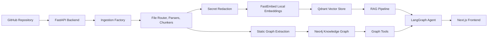

# Cortex Project Walkthrough

This document is the internal reference guide for Cortex. It explains what the project is, what has been implemented, why the major decisions were made, how ingestion and retrieval work, and how to explain the system to another engineer or reviewer.

It is intentionally more detailed than the public `README.md`.

---

## 1. Project Purpose

Cortex is a code intelligence system for GitHub repositories.

The goal is to let a user connect their GitHub account, ingest a repository, and then ask useful engineering questions about that repository. Cortex answers using indexed source code, repository metadata, semantic search, and graph-based structural context.

The core user journey is:

1. User signs in with GitHub OAuth.
2. User selects a GitHub repository.
3. Cortex ingests the repository.
4. Cortex builds two indexes:
   - a semantic vector index in Qdrant
   - a structural knowledge graph in Neo4j
5. User asks questions through the query interface.
6. Cortex retrieves relevant context and generates grounded answers.
7. User can inspect architecture snapshots and graph relationships.

The project direction has shifted from being a broad "AI SaaS" experiment into a focused **repository ingestion + RAG + GraphRAG code intelligence platform**.

---

## 2. Current Status

The main working path is now:

- GitHub OAuth login works.
- Authenticated users can list their GitHub repositories.
- Repository ingestion works for small repositories.
- Local embeddings are used instead of a remote embeddings API.
- Chunks are stored in Qdrant.
- Graph nodes and relationships are stored in Neo4j.
- The query page can answer repository-specific questions.
- Architecture snapshots are generated after ingestion.
- Global brain metrics update from Qdrant and Neo4j.
- The graph page has been fixed to return JSON-safe Neo4j graph data.

The UI still has polish issues. That is currently acceptable because the main objective has been to get the end-to-end intelligence loop working:

```text
Login -> Ingest -> Index -> Query -> Inspect
```

---

## 3. High-Level Architecture



Cortex has three major layers:

1. **Frontend**
   - Next.js and React UI.
   - Handles login, repo selection, ingestion controls, query UI, architecture snapshot view, and graph visualization.

2. **Backend**
   - FastAPI service.
   - Handles OAuth, sessions, ingestion jobs, GitHub access, vector search, graph search, and LLM generation.

3. **Data Stores**
   - Qdrant stores semantic chunks and embeddings.
   - Neo4j stores graph entities and relationships.

The important architectural decision is that Cortex does not rely on only one retrieval method. It uses:

- **RAG** for semantic similarity.
- **GraphRAG** for structural relationships.

---

## 4. Why RAG Alone Is Not Enough

Plain RAG treats a codebase as a collection of text chunks.

That works well for questions like:

- "Where is authentication handled?"
- "What does this repository do?"
- "Explain the CI workflow."

But plain vector retrieval is weaker for structural questions like:

- "What imports this module?"
- "What functions call this function?"
- "What files are connected to this dependency?"
- "Which pull requests modified this area?"

Those questions require a graph of relationships, not just semantic similarity.

That is why Cortex uses a twin-index design:

| Need | System |
| --- | --- |
| Meaning and conceptual similarity | Qdrant vector retrieval |
| Software structure and topology | Neo4j graph retrieval |
| Natural language answer synthesis | Gemini / Groq through RAG or agent tools |

---

## 5. GitHub Authentication

Authentication is based on GitHub OAuth.

The flow is:

1. Frontend calls `GET /api/v1/auth/github/login`.
2. Backend creates a GitHub OAuth URL.
3. User authorizes the app on GitHub.
4. GitHub redirects back to `/auth/callback` on the frontend.
5. Frontend sends the code to `POST /api/v1/auth/github/callback`.
6. Backend exchanges the code for a GitHub access token.
7. Backend fetches the GitHub profile.
8. Backend creates a Cortex session.
9. Browser receives an HttpOnly cookie.

Important decisions:

- The GitHub access token is not stored in frontend JavaScript.
- The frontend uses cookie-based auth with `credentials: "include"`.
- The backend resolves the current user through `GET /api/v1/auth/me`.
- OAuth callback double-submit was fixed on the frontend so the same code is not exchanged twice.
- OAuth token exchange was hardened to use trimmed credentials and form-encoded GitHub requests.

Why this matters:

- It keeps the frontend simpler.
- It prevents accidental token exposure in local storage.
- It lets backend routes consistently derive the authenticated user.

---

## 6. Repository Ingestion

Ingestion is the most important part of Cortex.

The ingestion endpoint is:

```text
POST /api/v1/ingest
```

It starts a background ingestion job and returns a job ID. The frontend then polls:

```text
GET /api/v1/ingest/jobs/{job_id}
```

The backend also has SSE support through:

```text
GET /api/v1/ingest/stream
```

The current frontend primarily relies on polling-friendly status updates.

### 6.1 Ingestion Job Flow

When ingestion starts:

1. Backend validates repo format: `owner/repo`.
2. Backend fetches repository metadata from GitHub.
3. Backend checks repo size against `MAX_REPO_SIZE_MB`.
4. Backend creates a `Repository` node in Neo4j with status `processing`.
5. `IngestionPipeline` starts the actual repository indexing.
6. Progress events are published into the in-memory job store.
7. On success, repository status becomes `ready`.
8. On failure, repository status becomes `failed`.

### 6.2 Why Background Jobs Were Added

Earlier ingestion was too long-running for a single request/response path.

Background jobs were added so:

- the frontend gets an immediate response
- progress can be tracked
- the user can see ingestion stages
- failures can be reported cleanly

The job store is currently in memory. That is fine for local MVP use, but it means a backend restart or dev reload can lose active job state.

---

## 7. GitHub Client Design

Cortex fetches repository data directly from GitHub.

Important improvements were made:

- A shared `httpx.AsyncClient` lifecycle is used.
- `GitHubClient` supports `async with GitHubClient(...)`.
- Retry/backoff was added for transient GitHub failures.
- Fetch concurrency is configurable.
- Hard failures like `401`, `403`, `404`, and `422` are not blindly retried.
- Transient failures like `429`, `502`, `503`, and `504` are retried.

Why this matters:

- Large repo ingestion requires many GitHub API/blob requests.
- Creating a new HTTP client per file is inefficient.
- GitHub can rate limit or temporarily fail.
- Retries should help transient errors without hiding real auth or repo issues.

Key settings:

```env
GITHUB_FETCH_CONCURRENCY=25
FILE_PROCESSING_CONCURRENCY=8
GITHUB_REQUEST_TIMEOUT_SECONDS=30
GITHUB_CONNECT_TIMEOUT_SECONDS=10
GITHUB_RETRY_ATTEMPTS=3
```

---

## 8. File Routing and Chunking

After Cortex fetches file contents, it decides whether and how to process each file.

The pipeline:

1. Get file tree.
2. Filter unsupported or oversized files.
3. Fetch eligible contents.
4. Route each file by type/language.
5. Parse and chunk the file.
6. Attach metadata to each chunk.

Chunk metadata usually includes:

- repo
- file path
- language
- source type
- chunk type
- function name
- class name
- signature
- start line
- end line
- source text

This metadata is crucial because retrieval is not useful unless the final answer can cite where the information came from.

### Chunk Types

Cortex supports different chunking strategies:

- code chunks
- documentation chunks
- config chunks
- issue chunks
- pull request chunks

For code, the goal is to chunk around meaningful program structures such as functions, methods, classes, or logical code blocks.

For prose/config, the goal is to preserve meaningful sections.

---

## 9. Secret Redaction

Before content is indexed, Cortex scans for secret-like values.

The decision was to **redact and continue**, not skip entire files by default.

Why:

- Skipping whole files can destroy important architecture context.
- Redaction preserves useful structure while removing sensitive material.
- The user still gets an index of the repository without storing obvious secrets.

The pipeline redacts before:

- chunking
- embedding
- Qdrant upsert
- Neo4j graph extraction
- LLM prompt construction

Chunks from redacted files include metadata such as:

```text
security_censored=true
secrets_redacted=<count>
```

---

## 10. Embeddings Decision

One of the biggest blockers was remote embedding API rate limits.

The original ingestion flow was not practical because embedding many files through a remote API could fail or become too slow.

The fix was to move embeddings local with FastEmbed.

Current embedding model:

```text
BAAI/bge-base-en-v1.5
```

Current vector dimension:

```text
768
```

Why 768 dimensions:

- The project already expected 768-dimensional vectors.
- Keeping 768 avoided unnecessary Qdrant schema disruption.
- It made the migration safer than switching to a 384-dimensional model.

Important settings:

```env
EMBEDDING_BACKEND=fastembed
EMBEDDING_MODEL=BAAI/bge-base-en-v1.5
EMBEDDING_DIMENSIONS=768
EMBEDDING_BATCH_SIZE=64
EMBEDDING_CACHE_DIR=C:\tmp\cortex_fastembed_cache
EMBEDDING_LOCAL_FILES_ONLY=false
```

After the model is downloaded, `EMBEDDING_LOCAL_FILES_ONLY=true` can be used to avoid network fetches.

### Dense and Sparse Retrieval

Cortex creates:

- dense vectors through FastEmbed
- sparse vectors for lexical matching

This gives hybrid retrieval:

- dense retrieval catches semantic similarity
- sparse retrieval helps with exact names, identifiers, and keyword-heavy code queries

This is especially useful for code because names like `ci.yaml`, `auth`, `pipeline`, or `requirements.txt` can carry very important exact meaning.

---

## 11. Qdrant Vector Store

Qdrant stores the semantic retrieval layer.

Each chunk becomes a Qdrant point with:

- dense vector
- sparse vector
- payload metadata
- source text

Qdrant collection:

```env
QDRANT_COLLECTION=cortex_kb
```

Payloads include fields such as:

- `repo`
- `file_path`
- `language`
- `source_type`
- `chunk_type`
- `function_name`
- `class_name`
- `start_line`
- `end_line`
- `text`

The retrieval pipeline filters by repository and user context so a query can target a specific indexed repo.

### Why Qdrant

Qdrant was chosen because:

- it supports vector search well
- it supports payload filters
- it can store dense and sparse retrieval structures
- it is straightforward to use from Python
- it works well as the semantic memory layer

---

## 12. Neo4j Knowledge Graph

Neo4j stores structural facts about the repository.

This is the graph side of GraphRAG.

Graph node types include:

- `Repository`
- `File`
- `Function`
- `Class`
- `Module`
- `Dependency`
- `Issue`
- `PullRequest`
- `Commit`
- `Contributor`
- `Label`

Graph relationships include:

- `CONTAINS`
- `IMPORTS`
- `CALLS`
- `DEPENDS_ON`
- `MODIFIES`
- `CLOSES`
- `OPENED`

Example:

```text
Repository -[:CONTAINS]-> File
File -[:IMPORTS]-> Module
Function -[:CALLS]-> Function
Repository -[:DEPENDS_ON]-> Dependency
PullRequest -[:MODIFIES]-> File
PullRequest -[:CLOSES]-> Issue
Contributor -[:OPENED]-> Issue
```

### Static Graph Extraction

Cortex extracts graph relationships from source code and manifest files.

For Python:

- imports can become `IMPORTS`
- functions/classes can become nodes
- calls can become `CALLS`

For JavaScript/TypeScript:

- imports and dependency-related structures are extracted where supported

For manifests:

- `requirements.txt`
- `package.json`
- `go.mod`

These can produce dependency nodes and `DEPENDS_ON` relationships.

### Graph Serialization Fix

The graph endpoint originally failed after successful ingestion because Neo4j date/time objects were not JSON serializable.

The fix was to sanitize graph properties before returning them:

- dictionaries are recursively sanitized
- lists are recursively sanitized
- Neo4j date/time values are converted to ISO strings
- unknown objects fall back to strings

That made `/api/v1/graph/explore` return valid JSON for the frontend graph viewer.

---

## 13. Direct RAG Pipeline

The direct RAG endpoint is:

```text
POST /api/v1/query
```

The direct RAG flow:

1. User asks a question.
2. Cortex embeds the question using the same local embedder.
3. Cortex generates a sparse query vector.
4. Cortex searches Qdrant with filters such as repo/language.
5. Cortex assembles retrieved chunks into context blocks.
6. Cortex calls Gemini 2.5 Flash with strict grounding instructions.
7. Cortex returns an answer and source chunks.

The system prompt tells the model:

- answer only from provided context
- cite file paths, function names, and line numbers
- say when the answer is not in context
- keep the answer concise and useful

This path is reliable because it is simple:

```text
query -> embed -> retrieve -> generate -> answer
```

---

## 14. Agentic GraphRAG Pipeline

The agent endpoint is:

```text
POST /api/v1/agent_query
```

This path uses LangGraph.

Instead of doing one retrieval call, the agent can call tools before answering.

Available tools include:

- `search_code`
- `search_issues`
- `get_file_content`
- `get_call_graph`
- `get_file_history`
- `get_dependencies`
- `calculate_math`
- `ask_human_for_clarification`

### How The Agent Works

The agent receives:

- the user question
- optional target repository
- recent chat history
- user context

It can then decide which tool to call.

Examples:

- For "where is auth handled?", it may call semantic code search.
- For "what calls this function?", it may call `get_call_graph`.
- For "which package uses X?", it may call `get_dependencies`.
- For "show file history", it may call `get_file_history`.

### Critic Node

There is also a critic node designed to check whether the answer is grounded in retrieved context.

The critic reviews:

- tool outputs
- drafted answer

Then it decides whether the answer appears grounded or hallucinated.

If it flags hallucination, the agent gets a warning and can retry.

### Fallback Behavior

If the agent path fails, the backend falls back to direct RAG.

Why:

- agent orchestration can fail due to model/tool/runtime issues
- direct RAG is simpler and more reliable
- users should still get an answer when possible

This fallback was important during testing because it kept the query experience usable.

---

## 15. Architecture Snapshots

After ingestion, Cortex generates a repository architecture snapshot.

The snapshot is stored on the Neo4j `Repository` node and fetched later by:

```text
GET /api/v1/repos/{owner}/{repo_name}/snapshot
```

Purpose:

- provide a quick high-level understanding of the repo
- summarize purpose, stack, important files, risks, and structure
- give the user an immediate architecture overview without needing to ask a manual query

This is the feature shown in the repository manager drawer.

---

## 16. Global Brain Metrics

The global brain row shows aggregate indexed state.

The endpoint is:

```text
GET /api/v1/stats/global
```

It counts:

- Qdrant chunks
- Neo4j nodes
- indexed repositories
- Neo4j relationships

This was useful during testing because it confirmed whether ingestion actually wrote to the data stores.

For example, after successful ingestion, Qdrant and Neo4j counts increased and the query page worked.

---

## 17. Knowledge Graph Viewer

The graph page calls:

```text
GET /api/v1/graph/explore?repo=<owner/repo>&depth=2
```

The backend:

1. Checks repository access.
2. Queries Neo4j for repo-scoped relationships.
3. Converts Neo4j nodes and relationships into frontend graph JSON.
4. Sanitizes non-JSON-safe Neo4j property values.
5. Returns nodes and links.

The frontend uses:

```text
react-force-graph-3d
```

to render the graph.

The graph page initially failed because the endpoint built graph data successfully but crashed while serializing Neo4j `DateTime` values. That was fixed by converting those values to strings before returning JSON.

---

## 18. Repository Deletion

Repository deletion endpoint:

```text
DELETE /api/v1/repos/{owner}/{repo_name}
```

Deletion does two things:

1. Removes vector chunks from Qdrant.
2. Removes graph nodes from Neo4j.

This became important when an ingestion was interrupted midway. The system could have a repo node in Neo4j even if Qdrant did not have matching chunks yet.

Fix:

- Qdrant delete failures are tolerated when the collection/points are missing.
- Neo4j cleanup still runs.

This makes deletion robust for interrupted or partially failed ingests.

---

## 19. Webhook Decision

Webhook mutation was intentionally made conservative.

Problem:

- GitHub webhooks are repository-level events.
- Cortex needs to know which user-owned index should be updated.
- Without a reliable repo-to-user mapping, a webhook could mutate the wrong index.

Decision:

- accept and validate webhook events
- do not mutate Qdrant or Neo4j unless a target mapping exists

This prevents hidden background corruption while leaving a future path for proper webhook-driven re-indexing.

---

## 20. Frontend Surfaces

Current frontend surfaces:

- login page
- OAuth callback page
- repository manager
- ingest controls
- indexed repo list
- global brain metrics
- architecture snapshot drawer
- query page
- graph page

Important frontend fixes:

- auth callback now avoids duplicate OAuth code submissions
- fetches include credentials where needed
- graph viewer handles backend errors without crashing the whole page
- repo ingestion can show job progress and terminal states

The frontend is functional but not final. Current priority has been backend correctness and end-to-end behavior.

---

## 21. Backend API Map

Important backend routes:

| Route | Purpose |
| --- | --- |
| `GET /api/v1/auth/me` | Resolve current user |
| `GET /api/v1/auth/github/login` | Start GitHub OAuth |
| `POST /api/v1/auth/github/callback` | Complete OAuth |
| `POST /api/v1/auth/logout` | Logout |
| `GET /api/v1/github/my-repos` | List GitHub repos for signed-in user |
| `POST /api/v1/ingest` | Start repo ingestion |
| `GET /api/v1/ingest/jobs/{job_id}` | Poll ingestion progress |
| `GET /api/v1/ingest/stream` | Stream ingestion progress |
| `GET /api/v1/repos` | List indexed repos |
| `DELETE /api/v1/repos/{owner}/{repo_name}` | Delete indexed repo |
| `POST /api/v1/query` | Direct RAG query |
| `POST /api/v1/agent_query` | Agentic RAG/GraphRAG query |
| `GET /api/v1/graph/stats` | Graph stats |
| `GET /api/v1/graph/explore` | Graph visualization data |
| `GET /api/v1/stats/global` | Global brain metrics |
| `GET /api/v1/repos/{owner}/{repo_name}/snapshot` | Architecture snapshot |
| `POST /api/v1/repos/{owner}/{repo_name}/audit` | Agent-powered audit prompt |

---

## 22. Main Technologies

| Area | Technology | Why |
| --- | --- | --- |
| Frontend | Next.js, React, TypeScript | Fast local UI, app routing, type safety |
| Backend | FastAPI | Async API service, clean route structure |
| Vector DB | Qdrant | Dense/sparse retrieval with payload filters |
| Graph DB | Neo4j | Natural fit for code relationships |
| Embeddings | FastEmbed | Local embeddings avoid API rate limits |
| Embedding model | `BAAI/bge-base-en-v1.5` | 768-dim local model matching current collection design |
| LLM generation | Gemini 2.5 Flash | Fast grounded answer generation |
| Agent orchestration | LangGraph | Tool-calling workflow and critic loop |
| GitHub access | GitHub OAuth + API | User-specific repository access |
| Graph visualization | Three.js / `react-force-graph-3d` | Interactive repo graph |

---

## 23. Key Decisions and Why They Matter

### Decision 1: Use local embeddings

Problem:

- Remote embedding API limits blocked ingestion.

Decision:

- Switch to FastEmbed.

Impact:

- Faster ingestion.
- Fewer rate-limit failures.
- Query embeddings and ingestion embeddings use the same model.

### Decision 2: Keep 768 dimensions

Problem:

- Changing embedding dimensions requires recreating Qdrant collection schema.

Decision:

- Use `BAAI/bge-base-en-v1.5` at 768 dimensions.

Impact:

- Less disruption.
- Clear dimension guard in Qdrant.

### Decision 3: Use Qdrant and Neo4j together

Problem:

- Vector search alone does not model code relationships.

Decision:

- Use Qdrant for semantic memory and Neo4j for structure.

Impact:

- Cortex can answer both semantic and structural questions.

### Decision 4: Background ingestion jobs

Problem:

- Ingestion can take too long for one HTTP request.

Decision:

- Start ingestion as a background job and poll status.

Impact:

- Better UX.
- Better visibility into stages.
- Cleaner failure reporting.

### Decision 5: Redact secrets instead of skipping all affected files

Problem:

- Skipping files damages architecture understanding.

Decision:

- Redact detected secrets and keep indexing.

Impact:

- Safer storage.
- Better repository coverage.

### Decision 6: Disable unsafe webhook mutation

Problem:

- Webhook events do not automatically identify the correct Cortex tenant/index.

Decision:

- Do not mutate indexes until target mapping exists.

Impact:

- Prevents accidental cross-index corruption.

### Decision 7: Add direct RAG fallback for agent failures

Problem:

- Agent workflows can fail due to model/tool orchestration issues.

Decision:

- Fall back to direct RAG.

Impact:

- Query UX remains usable.

---

## 24. End-to-End Explanation Script

If you need to explain Cortex to someone, use this:

Cortex connects to a user's GitHub account through OAuth and lets them ingest a repository. During ingestion, it fetches files from GitHub, filters and parses them, redacts secrets, chunks the content, and embeds those chunks locally using FastEmbed. The chunks and vectors are stored in Qdrant for semantic retrieval.

At the same time, Cortex performs static analysis and writes repository structure into Neo4j. That graph captures files, functions, classes, imports, calls, dependencies, issues, pull requests, and relationships between them.

When the user asks a question, Cortex can use either direct RAG or an agentic GraphRAG flow. Direct RAG embeds the question, retrieves relevant chunks from Qdrant, and sends grounded context to Gemini for an answer. The agentic flow can additionally call graph tools, file tools, dependency tools, and semantic search tools before answering.

This design makes Cortex stronger than a normal "chat with repo" app because it combines semantic similarity with structural software knowledge. Qdrant helps find relevant meaning; Neo4j helps trace relationships; the LLM turns retrieved evidence into a clear answer.

---

## 25. Current Known Limitations

The project is working as an MVP, but these areas are not final:

- UI polish needs work.
- Ingestion jobs are stored in memory.
- Large repositories still need more stress testing.
- Webhook re-indexing is intentionally disabled unless target mapping is added.
- Static analysis coverage is strongest for supported languages and patterns.
- GraphRAG can become more advanced by expanding vector hits into graph neighborhoods automatically.
- Production deployment would need durable sessions, durable jobs, stronger observability, and stricter operational controls.

---

## 26. Validation Done So Far

The project has been validated through:

- GitHub OAuth login.
- Repository selection through GitHub account.
- Database resets for Qdrant and Neo4j.
- Successful ingestion of a small private repository.
- Qdrant chunk count verification.
- Neo4j node and relationship verification.
- Global brain metrics update.
- Query page answering a CI/CD workflow question with source-grounded details.
- Architecture snapshot generation.
- Graph endpoint serialization fix.
- Frontend TypeScript checks.
- Backend focused no-network verification tests.

The most important validation outcome:

```text
Ingestion worked, Qdrant had chunks, Neo4j had graph nodes/relationships, and the query page answered correctly from the indexed repository.
```

---

## 27. How To Resume Work

Recommended next sequence:

1. Keep testing small repositories first.
2. Verify graph page loads after backend restart.
3. Test delete and re-ingest flows.
4. Improve graph UI only after backend graph correctness is stable.
5. Test a medium repository.
6. Add durable job storage if long ingests become common.
7. Improve source citations and file navigation.
8. Add more realistic RAG evaluation examples.

---

## 28. Glossary

**RAG**

Retrieval-Augmented Generation. The system retrieves relevant context and gives it to an LLM so the answer is grounded in actual source material.

**GraphRAG**

RAG enhanced with graph relationships. Instead of retrieving only text chunks, the system can also retrieve connected entities and relationships from a graph database.

**Chunk**

A piece of source code, documentation, issue, PR, or config stored as a retrieval unit.

**Dense vector**

A numeric embedding representing semantic meaning.

**Sparse vector**

A lexical vector useful for exact or keyword-like matching.

**Qdrant**

The vector database used for semantic retrieval.

**Neo4j**

The graph database used for structural repository knowledge.

**FastEmbed**

The local embedding library used to generate 768-dimensional vectors.

**LangGraph**

The agent orchestration framework used to let Cortex call tools before answering.

**Architecture snapshot**

A generated summary of the repository's purpose, structure, important files, and potential risks.

---

## 29. One-Line Summary

Cortex is a GitHub repository intelligence system that combines local embeddings, Qdrant vector search, Neo4j knowledge graphs, and LLM generation to make codebases searchable, explainable, and structurally navigable.
