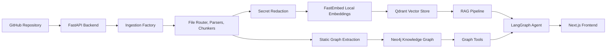

# Cortex

Cortex is a repository intelligence system that turns GitHub repositories into a searchable semantic index and a structured knowledge graph. It is designed for codebase understanding workflows where a user needs to ingest a repository, ask grounded technical questions, inspect architecture, and trace relationships between files, functions, dependencies, issues, and pull requests.

The current implementation focuses on three core capabilities:

- **Repository ingestion** from GitHub, authenticated through GitHub OAuth.
- **Hybrid RAG over source code** using local dense embeddings, sparse lexical signals, and Qdrant.
- **Graph-aware code intelligence** using Neo4j to preserve structural relationships that vector search alone cannot represent.

Cortex is intentionally built as a GraphRAG-style system rather than a plain chatbot over files. Vector retrieval is used to find semantically relevant code and documents; graph retrieval is used to recover deterministic relationships such as repository ownership, file containment, imports, calls, dependency declarations, and GitHub metadata links.

## Current Status

Cortex is an active MVP. The authentication and ingestion path is implemented and usable locally. The UI is functional but still evolving. The primary validated path is:

1. Sign in with GitHub OAuth.
2. Select or submit a repository.
3. Ingest source files into Qdrant and Neo4j.
4. Query the indexed repository through the code intelligence agent.
5. Inspect global repository metrics, generated architectural snapshots, and graph data.

## Architecture Overview



## RAG and GraphRAG Model

### Semantic Retrieval

Cortex stores code and repository artifacts as retrieval chunks in Qdrant. Each chunk includes source metadata such as repository, file path, language, source type, function or class name, and line numbers where available.

Dense embeddings are generated locally with FastEmbed using:

- `BAAI/bge-base-en-v1.5`
- 768-dimensional vectors
- configurable batch size through `EMBEDDING_BATCH_SIZE`

Local embeddings remove the OpenAI embeddings API rate-limit bottleneck and make ingestion practical for larger repositories. Cortex also generates sparse lexical vectors and stores both dense and sparse signals in Qdrant, giving retrieval a hybrid semantic and keyword-aware behavior.

### Structural Retrieval

Vector search is good at finding relevant code by meaning, but it does not reliably answer structural questions by itself. Cortex therefore builds a Neo4j graph during ingestion.

The graph stores repository entities and relationships such as:

- `Repository`
- `File`
- `Function`
- `Class`
- `Module`
- `Dependency`
- `Issue`
- `PullRequest`
- `Commit`
- `Contributor`

Typical relationships include:

- `CONTAINS`
- `IMPORTS`
- `CALLS`
- `DEPENDS_ON`
- `MODIFIES`
- `CLOSES`
- `OPENED`

This allows Cortex to answer questions that require topology rather than only similarity, such as:

- Which files import a module?
- What functions call this function?
- Which dependencies are declared by this repository?
- Which pull requests modified a file?
- What files are structurally connected to this architecture area?

### Agentic Retrieval

The `/api/v1/agent_query` path uses a LangGraph supervisor that can call retrieval tools before producing an answer. The current toolset includes:

- semantic code search
- issue and PR search
- file content retrieval
- call graph lookup
- file history lookup
- dependency lookup
- basic calculation
- clarification request

The agent is instructed to cite file paths, functions, and line numbers when available. If the agent path fails, the backend falls back to the direct RAG pipeline so the user can still receive a grounded response from retrieved Qdrant context.

## Ingestion Pipeline

The ingestion pipeline is optimized for repository-scale processing and reliable indexing behavior.

1. **Repository metadata check**
   - Validates repository format.
   - Fetches GitHub metadata using the authenticated user's GitHub token.
   - Enforces a maximum repository size through `MAX_REPO_SIZE_MB`.

2. **File discovery and filtering**
   - Fetches the repository tree from GitHub.
   - Filters unsupported, oversized, or irrelevant files.
   - Fetches eligible file contents concurrently.

3. **Parsing and chunking**
   - Routes files by language and source type.
   - Uses AST-aware chunking for code where supported.
   - Uses content chunking for documentation and configuration.
   - Preserves file path, source type, line range, function/class metadata, and language metadata.

4. **Secret redaction**
   - Scans file, issue, and pull request text before persistence.
   - Redacts detected secret-like values before chunks are embedded or stored.
   - Marks affected chunks with security metadata.

5. **Vector indexing**
   - Generates local dense vectors with FastEmbed.
   - Generates sparse vectors for lexical retrieval.
   - Upserts repository-scoped chunks into Qdrant.

6. **Graph indexing**
   - Creates Neo4j nodes for repositories and files.
   - Extracts static Python and JavaScript/TypeScript relationships.
   - Parses dependency manifests such as `requirements.txt`, `package.json`, and `go.mod`.
   - Optionally indexes issues, pull requests, and commits when enabled.

7. **Snapshot generation**
   - Produces a repository-level architectural snapshot after ingestion.
   - Stores the snapshot for fast retrieval from the repository manager UI.

Ingestion progress is tracked through an in-memory job store and exposed through polling-friendly job status endpoints. In local development, restarting the backend clears active in-memory job state.

## Backend API Surface

Primary implemented routes include:

| Route | Purpose |
| --- | --- |
| `GET /api/v1/auth/me` | Resolve the current authenticated user |
| `GET /api/v1/auth/github/login` | Start GitHub OAuth |
| `POST /api/v1/auth/github/callback` | Complete GitHub OAuth |
| `POST /api/v1/auth/logout` | Clear the session |
| `GET /api/v1/github/my-repos` | List repositories available through GitHub |
| `POST /api/v1/ingest` | Start repository ingestion |
| `GET /api/v1/ingest/jobs/{job_id}` | Poll ingestion job status |
| `GET /api/v1/repos` | List indexed repositories |
| `DELETE /api/v1/repos/{owner}/{repo_name}` | Delete indexed repository data |
| `POST /api/v1/query` | Direct RAG query |
| `POST /api/v1/agent_query` | Agentic RAG/GraphRAG query |
| `GET /api/v1/graph/stats` | Return graph statistics |
| `GET /api/v1/graph/explore` | Return graph visualization data |
| `GET /api/v1/stats/global` | Return global brain metrics |
| `GET /api/v1/repos/{owner}/{repo_name}/snapshot` | Fetch repository architecture snapshot |
| `POST /api/v1/repos/{owner}/{repo_name}/audit` | Run a repository audit prompt |

## Frontend

The frontend is a Next.js application. Current product surfaces include:

- GitHub OAuth login flow.
- Repository manager.
- Repository ingestion controls.
- Ingestion progress display.
- Indexed repository cards.
- Global brain metrics.
- Query interface for the code intelligence agent.
- Architecture snapshot drawer.
- Knowledge graph viewer.

The UI is still being iterated. The current priority of the project is correctness of ingestion, retrieval, graph construction, and query behavior.

## Technology Stack

| Layer | Technology |
| --- | --- |
| Frontend | Next.js, React, TypeScript |
| Visualization | `react-force-graph-3d`, Three.js |
| Backend | FastAPI, Pydantic |
| Agent Orchestration | LangGraph, LangChain |
| Vector Database | Qdrant |
| Graph Database | Neo4j AuraDB |
| Embeddings | FastEmbed, `BAAI/bge-base-en-v1.5`, 768 dimensions |
| Generation | Gemini 2.5 Flash, Groq Llama 3.3 where configured |
| Authentication | GitHub OAuth, HttpOnly JWT cookies |

## Configuration

Create a `.env` file at the repository root. Use `.env.example` as the starting point.

Required for normal local operation:

```env
GITHUB_OAUTH_CLIENT_ID=
GITHUB_OAUTH_CLIENT_SECRET=

QDRANT_URL=
QDRANT_API_KEY=
QDRANT_COLLECTION=cortex_kb

NEO4J_URI=
NEO4J_USERNAME=neo4j
NEO4J_PASSWORD=

GEMINI_API_KEY=

EMBEDDING_BACKEND=fastembed
EMBEDDING_MODEL=BAAI/bge-base-en-v1.5
EMBEDDING_DIMENSIONS=768
EMBEDDING_BATCH_SIZE=64
EMBEDDING_CACHE_DIR=C:\tmp\cortex_fastembed_cache
EMBEDDING_LOCAL_FILES_ONLY=false

BACKEND_URL=http://localhost:8000
FRONTEND_URL=http://localhost:3000
CORS_ORIGINS=http://localhost:3000
NEXT_PUBLIC_API_URL=http://localhost:8000
```

Optional but supported:

```env
GITHUB_PAT=
GITHUB_WEBHOOK_SECRET=
GROQ_API_KEY=
MAX_REPO_SIZE_MB=500
GITHUB_FETCH_CONCURRENCY=25
FILE_PROCESSING_CONCURRENCY=8
GITHUB_RETRY_ATTEMPTS=3
INGEST_JOB_MAX_AGE_SECONDS=3600
INGEST_JOB_MAX_EVENTS=500
```

For GitHub OAuth, configure the OAuth callback URL as:

```text
http://localhost:3000/auth/callback
```

## Local Development

### Backend

```powershell
cd backend
.\.venv\Scripts\python.exe -m uvicorn main:app --reload --host 127.0.0.1 --port 8000
```

### Frontend

```powershell
cd frontend
npm run dev
```

Open:

```text
http://localhost:3000
```

## Validation

Useful checks:

```powershell
cd backend
.\.venv\Scripts\python.exe -m unittest test_phase7_verification.py
```

```powershell
cd frontend
npx tsc --noEmit
```

For end-to-end validation, use a small repository first:

1. Start backend and frontend.
2. Sign in with GitHub.
3. Ingest a small repository.
4. Confirm the repository status becomes ready.
5. Confirm Qdrant chunk count increases.
6. Confirm Neo4j nodes and relationships increase.
7. Ask a repository-specific question in the query page.
8. Open the graph page and confirm graph data loads.
9. Delete the repository and confirm both vector and graph data are removed.

## License

MIT License.
