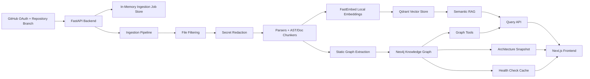

# Cortex

**Cortex is a GitHub-connected code intelligence workspace for exploring real repositories with GraphRAG.**

It turns a selected repository branch into two linked memory layers:

- a semantic code index in Qdrant
- a structural knowledge graph in Neo4j

From there, Cortex can answer grounded technical questions, show the exact cited chunks behind an answer, trace graph/tool usage, generate architecture snapshots, run evidence-led health checks, and visualize the repository as an interactive 3D graph.

It is built around one focused flow:

```text
GitHub login -> choose repo -> choose branch -> ingest -> query -> inspect citations -> explore graph
```

Cortex is not a generic chatbot over files. It is a code intelligence system where vector retrieval handles meaning, graph retrieval handles structure, and the UI exposes the evidence instead of hiding it.

## Why This Exists

Most repo-chat tools can retrieve similar chunks, but they often lose the structure that makes code understandable: imports, dependencies, functions, files, branches, commits, and architecture boundaries.

Cortex was built to combine both:

- **Semantic memory** for "where is this concept explained or implemented?"
- **Graph memory** for "what imports this, calls this, depends on this, or belongs together?"
- **Visible evidence** so every useful answer can be inspected instead of blindly trusted.

The project originally used remote embedding APIs, but repository ingestion quickly hit practical rate-limit and cost ceilings. Cortex now uses a local FastEmbed model for embeddings, which made indexing much more practical for local development while keeping LLM calls reserved for final answer synthesis, snapshots, and health reports.

## Architecture Overview



## Core Features

- **GitHub OAuth only**
  - Uses GitHub OAuth for repository access.
  - Stores the GitHub access token only in the backend in-memory session store.
  - Uses HttpOnly cookies for the browser session.

- **Branch-aware ingestion**
  - Users choose the branch to ingest.
  - `repo + branch` is treated as the indexed unit.
  - Chunks, graph nodes, snapshots, health checks, and queries are scoped by branch.
  - Repository cards show branch and commit metadata.

- **Manual re-ingestion**
  - Repository cards include an update action.
  - Cortex compares the indexed commit SHA with the latest GitHub branch SHA.
  - If unchanged, no ingestion runs.
  - If changed, the same `repo + branch` index is refreshed rather than creating duplicate branch entries.

- **AST-aware chunking**
  - Code is chunked around meaningful units such as functions/classes where supported.
  - Documentation and config files are chunked separately.
  - Chunks retain file path, language, branch, commit SHA, source type, function/class name, section title, and line ranges where available.

- **Hybrid semantic retrieval**
  - Uses local FastEmbed dense embeddings.
  - Uses sparse lexical vectors alongside dense vectors.
  - Stores retrieval chunks in Qdrant.
  - Default query depth is `top_k=7` cited chunks.

- **Knowledge graph retrieval**
  - Stores structural repository data in Neo4j.
  - Represents repositories, files, functions, classes, dependencies, and GitHub metadata when indexed.
  - Supports graph-oriented questions such as dependency usage and call graph lookups.
  - Hybrid queries can use graph retrieval first and semantic RAG for the final cited answer.

- **Visible retrieval trace**
  - Query answers include a trace showing which route/tool ran.
  - Trace entries distinguish semantic retrieval, graph retrieval, and fallback behavior.
  - Successful graph + semantic answers are labeled as hybrid.

- **Dual-pane cited chunk UI**
  - Query page shows the answer on the left and the selected cited chunk on the right.
  - Clicking a citation card opens that exact chunk with metadata.
  - Cited chunks include branch, commit, language, source type, section/function metadata, score, and code/doc text.

- **Architecture snapshots**
  - Ingestion generates a concise architecture snapshot after indexing.
  - Snapshots are stored on the repository node in Neo4j.
  - The repository manager can open the snapshot in a drawer.

- **Repository health check**
  - Produces an evidence-led repository health report.
  - Uses indexed graph/vector signals and retrieved evidence.
  - Does not claim to be a complete security audit.
  - Reports distinguish evidence-backed findings, heuristics, and manual-review areas.
  - Health reports are cached per latest indexed commit and loaded from Neo4j on later clicks.
  - UI renders the report with collapsible sections.

- **Privacy and secret safety**
  - Ingestion redacts detected secret-like values before persistence.
  - Secret-related chunks are marked with security metadata.
  - Secret-seeking questions, such as requests for `.env` contents, receive privacy-safe answers.
  - Sensitive source text is redacted in cited chunks for secret-value requests.

- **3D knowledge graph viewer**
  - Interactive graph visualization using `react-force-graph-3d`.
  - Repository/branch selector.
  - Search/center-node control.
  - Node detail panel.
  - Legend only shows node types currently present in the loaded graph.

## Retrieval Model

### Semantic Retrieval

Cortex stores indexed chunks in Qdrant with dense and sparse vectors. Dense vectors come from FastEmbed, and sparse vectors provide keyword-aware retrieval. Each search is scoped by the authenticated user and, when selected, by repository and branch.

The query response includes:

- generated answer
- cited source chunks
- retrieval trace
- retrieval mode such as `semantic`, `hybrid`, `graph`, or `semantic_fallback`

### Graph Retrieval

Neo4j stores structural relationships extracted during ingestion. The graph is used for questions where topology matters, including:

- dependency usage
- import relationships
- call graph lookups
- file/repository containment
- graph visualization

When graph retrieval has useful data and semantic retrieval also runs, Cortex labels the result as `hybrid`. If graph retrieval has no usable data, Cortex falls back to semantic retrieval and shows that in the trace.

## Ingestion Pipeline

The ingestion pipeline runs as a background job and streams/polls progress events to the UI.

1. **Repository metadata**
   - Fetches GitHub repository metadata with the OAuth token.
   - Checks repository size against `MAX_REPO_SIZE_MB`.
   - Fetches the selected branch commit SHA.

2. **File discovery and filtering**
   - Fetches the GitHub tree for the selected branch.
   - Skips unsupported files and oversized files.
   - Skips common generated/build/vendor outputs.

3. **Content fetch**
   - Fetches eligible file content concurrently.
   - Concurrency is configurable through `GITHUB_FETCH_CONCURRENCY`.

4. **Secret redaction**
   - Detects common secret-like patterns.
   - Redacts values before embedding/storage.
   - Marks affected chunks as security-censored.

5. **Parsing and chunking**
   - Routes files by extension and source type.
   - Uses AST-aware code chunking where supported.
   - Uses document/config parsing for non-code files.
   - Preserves branch and commit metadata on chunks.

6. **Vector indexing**
   - Generates local FastEmbed dense vectors.
   - Generates sparse vectors.
   - Upserts chunks into Qdrant.

7. **Graph indexing**
   - Creates Neo4j nodes and relationships.
   - Builds repository/file/function/class/dependency structure.
   - Stores branch-aware graph metadata.

8. **Snapshot generation**
   - Generates an architecture snapshot.
   - Stores it on the Neo4j repository node.

9. **Cleanup and status**
   - Marks the repository branch as ready on success.
   - Cleans stale data from older ingest runs for the same branch.
   - Marks failed jobs as failed/update_failed when needed.

Active ingestion jobs are stored in memory. If the backend restarts, active job progress is lost, but indexed Qdrant/Neo4j data remains.

## Backend API Surface

Primary implemented routes:

| Route | Purpose |
| --- | --- |
| `GET /api/v1/auth/github/login` | Start GitHub OAuth |
| `POST /api/v1/auth/github/callback` | Complete GitHub OAuth and create a session |
| `GET /api/v1/auth/me` | Return the authenticated user |
| `POST /api/v1/auth/logout` | Clear the session |
| `GET /api/v1/github/my-repos` | List repositories available through the user's GitHub account |
| `GET /api/v1/github/repos/{owner}/{repo_name}/branches` | List branches for a GitHub repository |
| `POST /api/v1/ingest` | Start ingestion for a selected repo branch |
| `GET /api/v1/ingest/stream` | Stream ingestion events |
| `GET /api/v1/ingest/jobs/{job_id}` | Poll ingestion job status/events |
| `GET /api/v1/repos` | List indexed repo branches |
| `DELETE /api/v1/repos/{owner}/{repo_name}` | Delete indexed repo data, optionally scoped by branch |
| `POST /api/v1/repos/{owner}/{repo_name}/branches/{branch}/update` | Re-ingest a branch only if GitHub has a newer commit |
| `POST /api/v1/query` | Direct semantic RAG query |
| `POST /api/v1/agent_query` | Routed semantic/graph/hybrid query with trace |
| `GET /api/v1/graph/stats` | Return graph statistics |
| `GET /api/v1/stats/global` | Return global dashboard metrics |
| `GET /api/v1/graph/explore` | Return branch-scoped graph visualization data |
| `GET /api/v1/repos/{owner}/{repo_name}/snapshot` | Fetch stored architecture snapshot |
| `POST /api/v1/repos/{owner}/{repo_name}/health-check` | Generate or load cached repository health check |

There is also a backward-compatible `/audit` alias in the backend, but the product UI uses the Health Check feature.

## Frontend

The frontend is a polished Next.js application with GitHub-only access.

Implemented product surfaces:

- GitHub OAuth login page.
- Repository manager with GitHub repository dropdown.
- Branch selector for ingestion.
- Ingestion progress toasts and status messages.
- Indexed repository cards with branch, commit, readiness, snapshot, update, health, and delete actions.
- Architecture snapshot drawer.
- Repository health check drawer with collapsible report sections.
- Query workspace with answer pane and cited-chunk pane.
- Retrieval trace UI.
- Clickable citation cards.
- Global brain metrics.
- 3D knowledge graph page with repo/branch selector, center-node search, node detail panel, and data-driven legend.

## Technology Stack

| Layer | Technology |
| --- | --- |
| Frontend | Next.js, React, TypeScript |
| UI/Icons | CSS, lucide-react |
| 3D Graph | `react-force-graph-3d`, Three.js |
| Backend | FastAPI, Pydantic |
| Retrieval | Qdrant hybrid vector search |
| Graph | Neo4j AuraDB |
| Embeddings | FastEmbed, `BAAI/bge-base-en-v1.5`, 768 dimensions |
| Generation | Gemini 2.5 Flash; Groq-backed agent path where configured |
| Auth | GitHub OAuth, HttpOnly cookies, backend in-memory GitHub token session |

## Configuration

Create a `.env` file at the repository root. Use `.env.example` as a starting point.

Required for normal local operation:

```env
GITHUB_OAUTH_CLIENT_ID=
GITHUB_OAUTH_CLIENT_SECRET=

QDRANT_URL=
QDRANT_API_KEY=
QDRANT_COLLECTION=cortex_kb

NEO4J_URI=
NEO4J_USERNAME=neo4j
NEO4J_PASSWORD=

GEMINI_API_KEY=

EMBEDDING_BACKEND=fastembed
EMBEDDING_MODEL=BAAI/bge-base-en-v1.5
EMBEDDING_DIMENSIONS=768
EMBEDDING_BATCH_SIZE=64
EMBEDDING_CACHE_DIR=C:\tmp\cortex_fastembed_cache
EMBEDDING_LOCAL_FILES_ONLY=false

BACKEND_URL=http://localhost:8000
FRONTEND_URL=http://localhost:3000
CORS_ORIGINS=http://localhost:3000
NEXT_PUBLIC_API_URL=http://localhost:8000
```

Useful optional settings:

```env
GROQ_API_KEY=
MAX_REPO_SIZE_MB=500
GITHUB_FETCH_CONCURRENCY=25
FILE_PROCESSING_CONCURRENCY=8
GITHUB_RETRY_ATTEMPTS=3
GITHUB_REQUEST_TIMEOUT_SECONDS=30
GITHUB_CONNECT_TIMEOUT_SECONDS=10
INGEST_JOB_MAX_AGE_SECONDS=3600
INGEST_JOB_MAX_EVENTS=500
```

For GitHub OAuth, configure the OAuth callback URL as:

```text
http://localhost:3000/auth/callback
```

## Local Development

### Backend

```powershell
cd backend
.\.venv\Scripts\python.exe -m uvicorn main:app --reload --host 127.0.0.1 --port 8000
```

### Frontend

```powershell
cd frontend
npm run dev
```

Open:

```text
http://localhost:3000
```

## License

MIT License.
