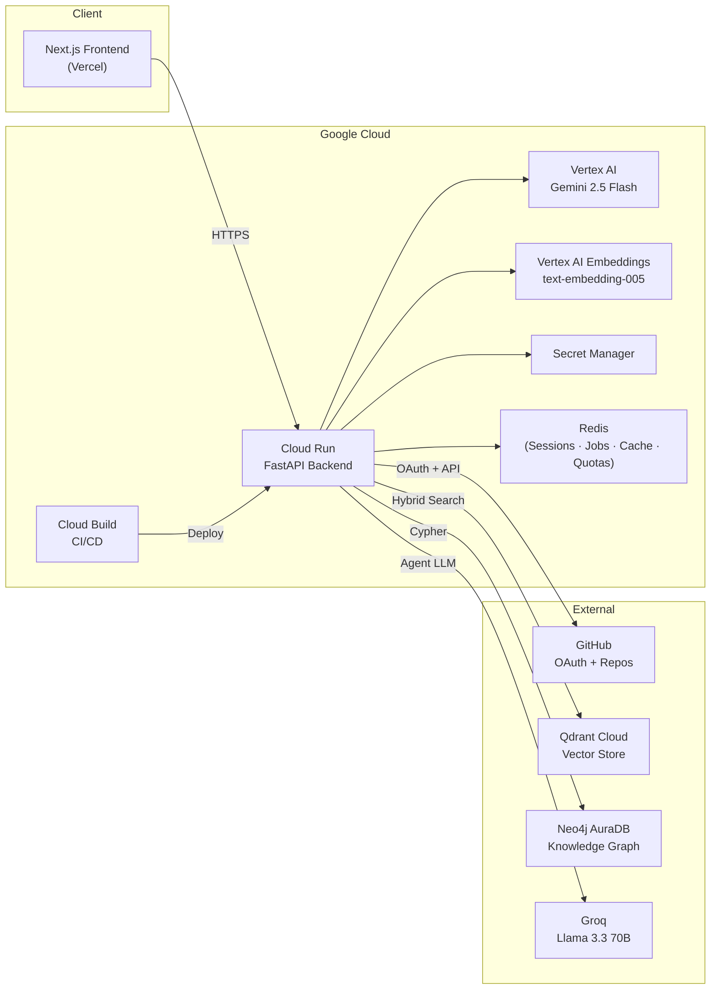
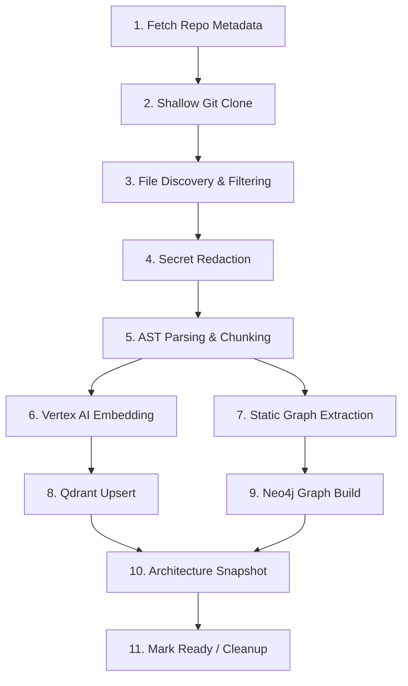

# Cortex

<p align="center">
  <strong>A multi-tenant GraphRAG code intelligence platform that transforms GitHub repositories into queryable knowledge bases.</strong>
</p>

<p align="center">
  
  
  
  
  
  
</p>

---

Cortex ingests a GitHub repository and builds two linked memory layers — a **semantic vector index** (Qdrant) and a **structural knowledge graph** (Neo4j). A LangGraph-powered agent then answers engineering questions using hybrid retrieval, exposing cited evidence and tool traces so every answer can be verified.

```
GitHub OAuth → Select Repository → Choose Branch → Ingest → Query → Inspect Citations → Explore Graph
```

> Cortex is not a generic chatbot over files. It is a code intelligence system where vector retrieval handles meaning, graph retrieval handles structure, and the UI exposes the evidence instead of hiding it.

---

## Why This Exists

Most repo-chat tools can retrieve similar text chunks but lose the structure that makes code understandable — imports, call graphs, dependencies, file hierarchies, branches, and architecture boundaries.

Cortex was built to combine both:

- **Semantic memory** — "where is this concept explained or implemented?"
- **Graph memory** — "what imports this, calls this, depends on this, or belongs together?"
- **Visible evidence** — every answer can be inspected, not blindly trusted.

---

## Architecture



### How It Works

1. **Authenticate** via GitHub OAuth. Session stored in Redis with HttpOnly cookies.
2. **Select** a repository and branch from your GitHub account.
3. **Ingest** — Cortex shallow-clones the repo, parses and chunks files using AST-aware chunkers, generates Vertex AI embeddings, and builds both a Qdrant vector index and a Neo4j knowledge graph.
4. **Query** — A LangGraph agent routes your question through semantic search, graph traversal, or both. Answers include cited source chunks and a full tool/retrieval trace.
5. **Explore** — Visualize the repository as an interactive 3D knowledge graph, inspect architecture snapshots, and run evidence-led health checks.

---

## Core Features

### Ingestion

- **Branch-aware indexing** — `repo + branch` is the indexed unit; chunks, graph nodes, snapshots, and queries are all branch-scoped.
- **AST-aware chunking** — Tree-sitter parses Python, JavaScript, TypeScript, and Go into function/class-level chunks. Documentation and config files use separate parsers.
- **Secret redaction** — Regex-based scanner detects and redacts secret-like patterns before any data is persisted.
- **Incremental updates** — Compares indexed commit SHA with the latest GitHub branch SHA; skips re-ingestion when unchanged.
- **Batched processing** — Memory-efficient chunked embedding with configurable batch sizes, rate limiting, and retry logic.
- **Shallow git clone** — Production ingestion uses `git clone --depth 1` for fast, bandwidth-efficient repository fetching.

### Retrieval & Agent

- **Hybrid vector search** — Dense embeddings (Vertex AI `text-embedding-005`, 768 dimensions) + sparse BM25-style lexical vectors in Qdrant.
- **Graph retrieval** — Neo4j stores structural relationships: repositories, files, functions, classes, imports, call graphs, dependencies, PRs, and commits.
- **LangGraph supervisor** — Multi-step agent with Groq Llama-3.3-70B (primary) and Gemini 2.5 Flash (fallback). Includes a critic node for hallucination self-checks and a circuit breaker at loop count ≥ 3.
- **7 agent tools** — `search_code`, `search_issues`, `get_file_content`, `get_call_graph`, `get_file_history`, `get_dependencies`, `calculate_math`, plus `ask_human_for_clarification`.
- **Retrieval trace** — Every response labels its retrieval mode (`semantic`, `graph`, `hybrid`, or `semantic_fallback`) and shows which tools were invoked.

### Intelligence

- **Architecture snapshots** — LLM-generated concise architecture summaries stored on the Neo4j repository node, viewable in a slide-out drawer.
- **Repository health checks** — Evidence-led health reports distinguishing confirmed findings, heuristics, and manual-review areas. Cached per commit; reloaded on subsequent requests.
- **Privacy-safe answers** — Secret-seeking questions (e.g., "show me the `.env` contents") receive redacted, privacy-safe responses.

### Frontend

- **Glassmorphism dark UI** — Custom CSS variables, no Tailwind, with neural-noise shader backgrounds and motion animations.
- **Top navigation** — Three core sections: **The Dock** (repository management), **Intel** (query workspace), and **Knowledge Graph** (3D explorer).
- **The Dock** — GitHub repo dropdown, branch selector, ingestion progress toasts, repo cards with status badges, snapshot/health/update/delete actions, and quick prompts.
- **Intel** — Dual-pane layout with answer + retrieval trace on the left and cited source chunks with full metadata on the right.
- **Knowledge Graph** — Interactive 3D graph (react-force-graph-3d + Three.js) with repo/branch selector, search-to-center, node detail panel, and data-driven legend.
- **Global Brain metrics** — Dashboard-level statistics across all indexed repositories.

---

## Technology Stack

| Layer | Technology |
|---|---|
| **Frontend** | Next.js 16, React 19, TypeScript |
| **UI** | Custom CSS (glassmorphism, dark theme), Lucide icons, Motion, Styled Components |
| **3D Visualization** | react-force-graph-3d, Three.js |
| **Code Highlighting** | Shiki |
| **Backend** | FastAPI, Pydantic, Python 3.11 |
| **Agent** | LangGraph, Groq Llama-3.3-70B (primary), Gemini 2.5 Flash (fallback) |
| **Embeddings** | Vertex AI `text-embedding-005` (production), FastEmbed `BAAI/bge-base-en-v1.5` (local dev) |
| **Vector Store** | Qdrant Cloud — 768-dim dense + sparse BM25 hybrid search |
| **Knowledge Graph** | Neo4j AuraDB |
| **LLM Generation** | Vertex AI Gemini 2.5 Flash (snapshots, health checks, summarization) |
| **Sessions & State** | Redis (sessions, job store, cache, rate-limit quotas) |
| **Auth** | GitHub OAuth, HttpOnly cookies, encrypted session tokens |
| **Hosting** | Google Cloud Run (backend), Vercel (frontend) |
| **CI/CD** | Google Cloud Build — auto-build and deploy on push to `main` |
| **Secrets** | Google Secret Manager |

---

## Backend API Surface

| Route | Purpose |
|---|---|
| `GET /api/v1/auth/github/login` | Start GitHub OAuth |
| `POST /api/v1/auth/github/callback` | Complete OAuth and create session |
| `GET /api/v1/auth/me` | Return authenticated user |
| `POST /api/v1/auth/logout` | Clear session |
| `GET /api/v1/github/my-repos` | List user's GitHub repositories |
| `GET /api/v1/github/repos/{owner}/{repo}/branches` | List branches for a repository |
| `POST /api/v1/ingest` | Start ingestion for a repo branch |
| `GET /api/v1/ingest/stream` | SSE stream of ingestion events |
| `GET /api/v1/ingest/jobs/{job_id}` | Poll ingestion job status |
| `GET /api/v1/repos` | List indexed repo branches |
| `DELETE /api/v1/repos/{owner}/{repo}` | Delete indexed data (optionally branch-scoped) |
| `POST /api/v1/repos/{owner}/{repo}/branches/{branch}/update` | Re-ingest if newer commit exists |
| `POST /api/v1/query` | Direct semantic RAG query |
| `POST /api/v1/agent_query` | Agent-routed hybrid query with trace |
| `GET /api/v1/graph/stats` | Graph statistics |
| `GET /api/v1/stats/global` | Global dashboard metrics |
| `GET /api/v1/graph/explore` | Branch-scoped graph visualization data |
| `GET /api/v1/repos/{owner}/{repo}/snapshot` | Architecture snapshot |
| `POST /api/v1/repos/{owner}/{repo}/health-check` | Health check (cached per commit) |
| `GET /health` | System health check |

---

## Ingestion Pipeline



**Supported languages for AST chunking:** Python, JavaScript, TypeScript, Go.
All other file types fall back to document/prose chunking or raw text splitting.

---

## Production Deployment

### Infrastructure

| Component | Service |
|---|---|
| **Backend** | Google Cloud Run (`cortex-backend`, `us-central1`) |
| **Frontend** | Vercel |
| **Vector DB** | Qdrant Cloud |
| **Graph DB** | Neo4j AuraDB |
| **Cache/State** | Redis (Cloud Run-accessible) |
| **Secrets** | Google Secret Manager |
| **CI/CD** | Google Cloud Build |

### CI/CD Pipeline

Continuous deployment is configured via `cloudbuild.yaml`. Every push to `main`:

1. Builds the Docker image from the root `Dockerfile`
2. Tags with `$COMMIT_SHA` for traceability and `latest` for convenience
3. Pushes to Artifact Registry (`us-central1-docker.pkg.dev`)
4. Deploys to Cloud Run with the commit-pinned image

### Production Environment Variables

| Variable | Description |
|---|---|
| `ENVIRONMENT` | `production` |
| `EMBEDDING_BACKEND` | `vertex` |
| `VERTEX_EMBEDDING_MODEL` | `text-embedding-005` |
| `EMBEDDING_DIMENSIONS` | `768` |
| `EMBEDDING_BATCH_SIZE` | `64` |
| `LLM_BACKEND` | `vertex` |
| `VERTEX_LLM_MODEL` | `gemini-2.5-flash` |
| `VERTEX_PROJECT_ID` | GCP project ID |
| `VERTEX_LOCATION` | `us-central1` |
| `INGEST_SOURCE` | `git_clone` |
| `JOB_STORE_BACKEND` | `redis` |
| `SESSION_STORE_BACKEND` | `redis` |
| `CACHE_BACKEND` | `redis` |
| `QUOTA_BACKEND` | `redis` |
| `REDIS_URL` | Redis connection string |
| `QDRANT_URL` | Qdrant Cloud endpoint |
| `QDRANT_API_KEY` | Qdrant API key |
| `NEO4J_URI` | Neo4j AuraDB connection URI |
| `NEO4J_PASSWORD` | Neo4j password |
| `GROQ_API_KEY` | Groq API key (agent primary LLM) |
| `GEMINI_API_KEY` | Gemini API key (agent fallback LLM) |
| `GITHUB_OAUTH_CLIENT_ID` | GitHub OAuth app client ID |
| `GITHUB_OAUTH_CLIENT_SECRET` | GitHub OAuth app client secret |

### Production Limits

| Limit | Default |
|---|---|
| Max repos per user | 2 |
| Max repo size | 500 MB |
| Max eligible files per repo | 500 |
| Max chunks per repo | 3,000 |
| Max concurrent ingests per user | 1 |
| Max global concurrent ingests | 2 |
| Max ingests per user per day | 30 |
| Max queries per user per day | 30 |
| Session TTL | 24 hours |

---

## Local Development

### Prerequisites

- Python 3.11+
- Node.js 18+
- Qdrant Cloud account (or local Qdrant instance)
- Neo4j AuraDB account (or local Neo4j instance)
- GitHub OAuth application
- Gemini API key or Groq API key

### Environment Setup

Create a `.env` file at the repository root:

```env
# Auth
GITHUB_OAUTH_CLIENT_ID=
GITHUB_OAUTH_CLIENT_SECRET=

# Databases
QDRANT_URL=
QDRANT_API_KEY=
QDRANT_COLLECTION=cortex_kb
NEO4J_URI=
NEO4J_USERNAME=neo4j
NEO4J_PASSWORD=

# LLM
GEMINI_API_KEY=
GROQ_API_KEY=

# Embeddings (local)
EMBEDDING_BACKEND=fastembed
EMBEDDING_MODEL=BAAI/bge-base-en-v1.5
EMBEDDING_DIMENSIONS=768
EMBEDDING_BATCH_SIZE=64

# URLs
BACKEND_URL=http://localhost:8000
FRONTEND_URL=http://localhost:3000
CORS_ORIGINS=http://localhost:3000
NEXT_PUBLIC_API_URL=http://localhost:8000
```

Configure the GitHub OAuth callback URL as `http://localhost:3000/auth/callback`.

### Run Locally

**Backend:**

```bash
cd backend
pip install -r requirements.txt
uvicorn main:app --reload --host 127.0.0.1 --port 8000
```

**Frontend:**

```bash
cd frontend
npm install
npm run dev
```

**Docker Compose (backend only):**

```bash
docker-compose up --build
```

Open `http://localhost:3000` to start.

---

## Project Structure

```
cortex/
├── backend/
│   ├── agents/              # LangGraph supervisor, critic, tools
│   ├── api/                 # FastAPI routes (auth, API, webhooks)
│   ├── core/                # Config, auth, LLM client, sessions, cache, rate limiting
│   ├── indexing/            # Embedder, Qdrant client, graph builder
│   ├── ingestion/           # Pipeline, parsers, GitHub client, git clone, secret scanner
│   ├── models/              # Pydantic schemas
│   ├── retrieval/           # RAG pipeline
│   ├── main.py              # FastAPI app factory
│   └── requirements.txt
├── frontend/
│   └── src/
│       ├── app/             # Next.js pages (login, repos, query, graph)
│       ├── components/      # TopNav, RepoCard, GraphViewer, Drawer, etc.
│       ├── context/         # Auth context provider
│       └── types/           # TypeScript type definitions
├── Dockerfile               # Production Docker image
├── docker-compose.yml       # Local development
├── cloudbuild.yaml          # CI/CD pipeline
└── README.md
```

---

## License

MIT License.
